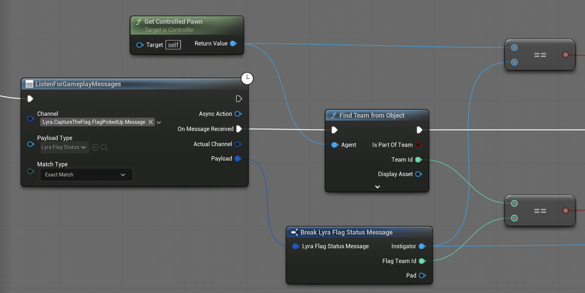

# 05 — Worked Example: Flag Pickup Listener

This document is a guided walkthrough of one feature that already exists in `B_ISW_AI`: the listener for `Lyra.CaptureTheFlag.FlagPickedUp.Message`. It shows how the agent updates multiple interrelated beliefs in a single moment, rather than scattering assignments across ad-hoc conditions throughout the behavior tree.

The goal: when someone picks up a flag, the agent updates its blackboard so the behavior tree can react on the next tick.

In Kubík's framework, a gameplay message is a hybrid of **reaktivní komunikace** ([Kubík 2004, Chapter 4.2.1] — stigmergic traces in the environment) and **komunikační akt** ([Kubík 2004, Chapter 4.4] — explicit pub/sub messaging in a higher-level language). The game broadcasts a typed event with well-defined semantics; agents that have subscribed treat it as a `vjem`. Crucially, this perception bypasses the `AIPerceptionComponent` — an agent on the other side of the map learns of the pickup even though it could not have seen it. This is the trade-off Kubík discusses on p. 17 between stigmergy and direct communication: stigmergy is realistic but slow and lossy; direct messaging is omniscient but limited to events the system explicitly emits.

## Payload: `LyraFlagStatusMessage`

Unlike the elimination listener which receives `LyraVerbMessage`, this listener works with the project-defined struct `LyraFlagStatusMessage`:

| Field         | Type     | Content                                                        |
| ------------- | -------- | -------------------------------------------------------------- |
| `Instigator`  | `APawn*` | The pawn that picked up the flag.                              |
| `FlagTeamId`  | `int32`  | The team that the agent who picked up the flag (Instigator) belongs to. |
| `Pad`         | `AActor*`| The flag pad the flag came from.                               |

## What we want the listener to do

Three situations are relevant:

1. **An enemy picked up our flag.** We need to set `OurFlagCaptured = true` and `EnemylagCarrier = Instigator` so the BT switches into the "recover our flag" branch and knows who to target.
2. **A teammate (or we ourselves) picked up the enemy flag.** We need to set `WePickedUpFlag = true` so the BT switches into the "protect the carrier" branch.
3. **We ourselves picked up the enemy flag.** In addition to case 2, we need to set `CarryingFlag = true` so the BT switches into the "return the flag home" branch.

## The handler, step by step

In Blueprint, the listener is a `Listen for Gameplay Messages` node configured with:

- **Channel:** `Lyra.CaptureTheFlag.FlagPickedUp.Message`
- **Payload Type:** `LyraFlagStatusMessage`

Its "On Message Received" exec wire goes into a small subgraph that runs the three checks below.


### Step 1 — Did an enemy pick up our flag?

We compare the message's `FlagTeamId` with our own team:

```
Self (AI Controller) → Get Controlled Pawn → FindTeamFromObject → TeamId
Payload.FlagTeamId
==
Branch:
  True:
    (FlagTeamId == our team → our flag was picked up)
    Blackboard → SetValueAsObject("EnemylagCarrier", Payload.Instigator)
    Blackboard → SetValueAsBool("OurFlagCaptured", true)
```




**Why do we check `FlagTeamId` and not the instigator's team?** The message reports whose flag was picked up. The instigator is the attacker — comparing their team would invert the logic. `FlagTeamId == our team` precisely says: our flag is in enemy hands.

**Why do we store `Instigator` directly rather than their PlayerState?** `EnemylagCarrier` is an `Object` key and `BTS_CheckLOS` works with a pawn reference for `LineOfSightTo`. We store the pawn. If you need the PlayerState (e.g. for another comparison), derive it from the pawn at the point of use — at the moment of pickup the pawn is guaranteed to be alive.

### Step 2 — Did a teammate pick up the enemy flag?

We use the same comparison but react to False instead of True:

```
==
Branch:
  False:
    (teammate is carrying the enemy flag → we are carrying)
    Blackboard → SetValueAsBool("WePickedUpFlag", true)
    Blackboard → SetValueAsObject("OurFlagCarrier", Payload.Instigator)
```

`WePickedUpFlag` is the signal for the BT to switch into the "protect the flag carrier" branch. It applies to the entire team, not just this agent.

### Step 3 — Am I the one who picked up the flag?

We compare the instigator against our controlled pawn (in the screenshot this is the upper equals operation):

```
Self (AI Controller) → GetControlledPawn
Payload.Instigator
==
Branch:
  True:
    Blackboard → SetValueAsBool("CarryingFlag", true)
```

**Why `GetControlledPawn` and not a `GetPlayerState` comparison?** The instigator is an `APawn*`. Pawn-to-pawn comparison is direct. At the time the message fires, the pawn is alive and the reference is valid.

## What the agent *cannot* learn from this message

Worth pausing on, because students sometimes overestimate what gameplay messages tell them:

- The message doesn't tell you exactly where the pickup happened — if you need the location, read it from `Payload.Pad` or `Payload.Instigator` inside the handler while they are valid.
- It doesn't tell you whether the carrier is currently visible — that is handled by the `BTS_CheckLOS` service at runtime.
- It is **server-side only**. Client-only code (like UI) cannot use it without going through a replicated property or RPC. AI controllers live on the server, so this is fine for us.
