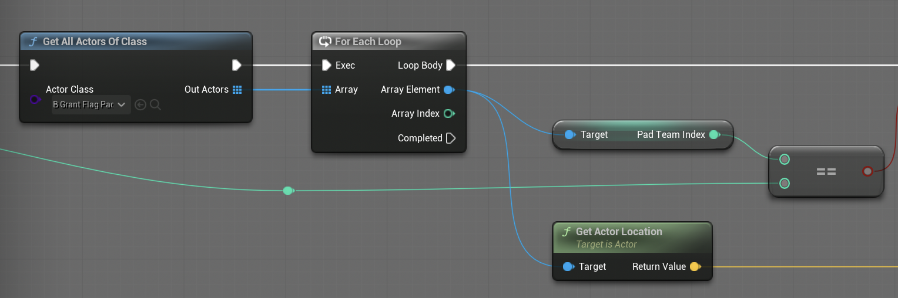
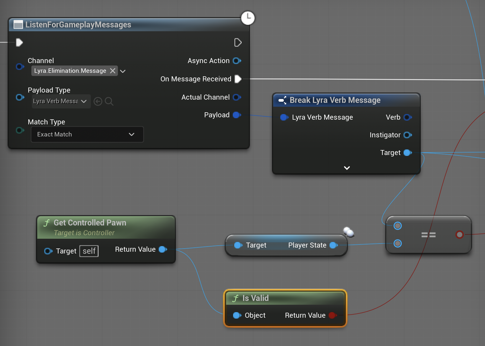

# 02 — Herní mód

Tento dokument popisuje pravidla CTF módu a aktéry, kteří v něm vystupují. Přečtěte si ho dřív, než se pustíte do návrhu agenta — nelze napsat inteligentního agenta pro hru, které dobře nerozumíte.

## Pravidla

Dva týmy. Každý tým má **vlajkovou základnu** na svém konci mapy. Na každé základně leží **vlajka**. Hráč nebo bot skóruje pro svůj tým takto:

1. Dojde k **základně nepřítele**.
2. Dotkne se nepřátelské vlajky, čímž ji **vyzvedne** a vlajka se mu připojí na postavu.
3. Vrátí se na **vlastní základnu**, stále s vlajkou.
4. **Doručí** vlajku na své základně — to mu připíše jeden bod za skóre a nepřátelská vlajka se respawnuje na svém domácím podstavci.

Pokud je nositel vlajky eliminován, vlajka se vrátí zpátky na základnu. Vlajka není jen jedna. Pokud tým ukradne jednu vlajku, může ukradnout i druhou.

Zápas končí, když některý tým dosáhne limitu skóre, nebo vyprší časovač kola (podle konfigurace experience).

## Aktéři

### `B_GrantFlagPad` — podstavec vlajky

Najdete v `Content/Blueprint/B_GrantFlagPad`. Každý tým má jeden. Důležité členy:

- **`PadTeamIndex`** *(int, proměnná třídy)* — kterému týmu tento podstavec patří. Tohle používejte pro získání Team ID daného flag padu.
- **`GetFlagTeamId()`** — accessor vracející totéž.
- `GrantOrDeliverFlag` — interní event pro vyzvedávání a doručování.

Existuje také helper `GetFlagPadByTeam` na `B_CaptureTheFlagScoring`, ale má race-condition problém při loadu experience. **Nepoužívejte ho.** Iterujte podstavce přímo:

```
GetAllActorsOfClass(B_GrantFlagPad) → For Each → porovnej PadTeamIndex
```



### `B_FlagActor` — vlajka

V `Content/Items/Flag/`. Toto je to, co se nese. Podstavec ji spawnuje při `BeginPlay` a respawnuje při auto-return / doručení. Nositelé ji připojují k socketu na své postavě.

### `B_CaptureTheFlagScoring`

V `Content/Blueprint/B_CaptureTheFlagScoring`. Sleduje skóre a vysílá herní zprávy uvedené níže.

### Herní zprávy

Hra rozesílá změny stavu skrz **Gameplay Message Subsystem** (Lyra). Jsou to publish/subscribe události na pojmenovaných kanálech s typovaným payloadem. V Blueprintu se přihlašujete uzlem `Listen for Gameplay Messages`.

V terminologii Kubíka je tento mechanismus blízký **komunikačním aktům** — explicitní zprávy ve vyšším jazyce nezávislé na fyzické viditelnosti agenta — s prvky **reaktivní komunikace / stigmergie**, protože emitorem nejsou samotní agenti, ale herní systém aktualizující "stopu" v prostředí.

| Kanál                                         | Payload type           | Vysílá se, když                                       |
| --------------------------------------------- | ---------------------- | ----------------------------------------------------- |
| `Lyra.CaptureTheFlag.FlagPickedUp.Message`    | `LyraFlagStatusMessage` | Vlajka je vyzvednuta (ze základny nebo ze země).     |
| `Lyra.CaptureTheFlag.FlagDelivered.Message`   | `LyraFlagStatusMessage` | Vlajka je doručena na vlastní základně (skóre).      |
| `Lyra.Elimination.Message`                    | `LyraVerbMessage`     | Libovolná postava je eliminována (server-side only). |

**`LyraFlagStatusMessage`** obsahuje:

- `Instigator` — aktor, který akci spustil (vyzvedávač nebo doručovatel).
- `FlagTeamId` *(int)* — tým, do kterého patří agent, který sebral vlajku - `Instigator`.
- `Pad` — `B_GrantFlagPad`, odkud byla vlajka sebrána.

**`LyraVerbMessage`** obsahuje:

- `Instigator` — aktor, který způsobil zabití.
- `Target` — **PlayerState eliminované postavy**, ne pawn. (V okamžiku, kdy zpráva přijde, už pawn může být zničený.)
- Několik dalších polí (verb/magnitude/source) — v CTF logice pravděpodobně nebudete potřebovat nevyužité.

Zprávy se vysílají **server-side**. Vystřelí na hostu / dedikovaném serveru. AI controllery na serveru je vidí, klienti ne. To nám vyhovuje — AI žije na serveru.

**Tipy:**
- Před použitím dat z přijaté zprávy nejprve musíte zprávu "rozbít" na jednotlivé key-value dvojice pomocí `Break <Payload type>`.
- `Target` u `LyraVerbMessage` je typu `PlayerState` a když to budete kontrolovat s jiným agentem, musíte vzít jeho `PlayerState` (viz. screenshot níže).



## Procházka mapou

`L_Limitation` je plná CTF aréna. Dvě základny na opačných koncích, sporné centrum, několik cesty s krytím. Pro evaluaci vašeho agenta používejte tuto mapu.

`L_ShooterCFT_FiringRange` je menší diagnostická mapa. Užitečná pro testování vnímání a střelby bez chaosu plného zápasu. Spawnovací chování je jednodušší.

## Posloupnost událostí při typickém skóre

1. Červený bot se spawnuje. Jeho `B_ISW_AI` proběhne `BeginPlay → ExperienceReady`, najde oba podstavce, nastaví `OwnFlagBaseLocation` (červená základna) a `EnemyFlagBaseLocation` (modrá základna) na blackboardu.
2. Behavior Tree (`BT_ISW_CTF_bot`) se nastartuje v `OnPossess` a začne se navigovat na `EnemyFlagBaseLocation`.
3. Červený bot se dotkne modré vlajky. Lyra Equipment / skórovací systém vystřelí `Lyra.CaptureTheFlag.FlagPickedUp.Message` s `FlagTeamId = modrá, Instigator = červený bot`.
4. Controller červeného bota tuto zprávu poslouchá a nastaví si `WePickedUpFlag = true` a `CarryingFlag = true` na vlastním blackboardu.
5. Současně controllery **modrých** botů dostanou tutéž zprávu. Všimnou si, že `FlagTeamId == jejich tým` a nastaví si `OurFlagCaptured = true` a `FlagCarrier = Instigator`.
6. Modří boti přepnou chování: pronásledují `FlagCarrier`. BT používá `BTS_CheckLOS` na bránění střelby přímou viditelností na nositele.
7. Buď: červený bot dojde k základně a vyvolá `Lyra.CaptureTheFlag.FlagDelivered.Message` (skóre!), nebo zemře a vystřelí `Lyra.Elimination.Message` s `Target = PlayerState červeného bota`.
8. Při eliminaci nositele modré controllery vyčistí `OurFlagCaptured` a `FlagCarrier`; controller červeného nositele vyčistí `CarryingFlag` a `WePickedUpFlag`. Vlajka padá na zem. Detailně viz [05 — Příklad: listener eliminace](05-Example-Elimination-Listener.md).

Tohle je smyčka, kterou budete ladit, nahrazovat, nebo přestavovat.
