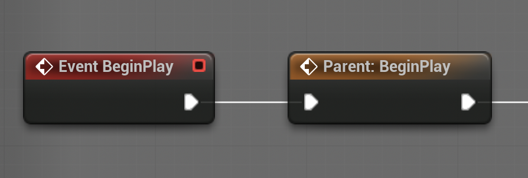

# 03 — Architektura AI

Tento dokument mapuje pojmy z knihy **Kubík, A. — *Inteligentní agenty*** na konkrétní stack Lyra / Unreal AI, ve kterém budete pracovat. Pokud rozumíte oběma stranám tohoto mapování, zbytek dokumentace půjde samo.

## 3.1 Kubíkova definice agenta

Výchozím bodem knihy je definice na straně 12:

> *„Agent je entita zkonstruovaná za účelem kontinuálně a do jisté míry autonomně plnit své cíle v adekvátním prostředí na základě vnímání prostředí prostřednictvím **senzorů** a prováděním akcí prostřednictvím **aktuátorů**. Agent přitom ovlivňuje podmínky v prostředí tak, aby se přibližoval k plnění cílů.“*
> — [Kubík 2004, Úvod, s. 12]

Kubík klade na agenta především tři vlastnosti:

- **autonomii**,
- **existenci v prostředí** a
- **kontinuitu senzorického a aktuačního propojení s prostředím**.

Vše ostatní — vnímání, představy, rozhodování, akce — je usazené do tohoto rámce.

## 3.2 Formální model

Kniha uvádí formální model reaktivního agenta jako šestici:

```
{ P, A, I, vjem, změna_stavu, akce }
```

kde

- `P` — množina možných **vjemů**
- `A` — množina možných **akcí**
- `I` — množina možných **vnitřních stavů**
- `vjem : E → P` — funkce vjemu: stav prostředí → vjem
- `změna_stavu : P × I → I` — funkce změny vnitřního stavu
- `akce : P × I → A` — funkce výběru akce

Podmnožina `C ⊆ I` je množina **cílových stavů**. Čistě reaktivní agent z modelu vypouští `I` a redukuje se na `akce : P → A`.

V kódu má náš agent přesně tento tvar:

| Symbol           | V ShooterCTF                                                                  |
| ---------------- | ----------------------------------------------------------------------------- |
| `E`              | Svět Unrealu: postavy, geometrie, předměty, vlajky, podstavce.               |
| `vjem`           | `AIPerceptionComponent` + listenery herních zpráv.                            |
| `P`              | Okamžitá informace dodaná vjemem (spatřený nepřítel, zpráva o vyzvednutí). |
| `I`              | Blackboard (`BB_ISW_Bot`).                                                    |
| `změna_stavu`    | Cokoliv, co zapisuje na Blackboard — handlery eventů na controlleru, BT služby, dekorátory. |
| `akce`           | Rozhodnutí Behavior Tree, který listový task spustit.                         |
| `A`              | BT tasky: `MoveTo`, Lyra shooting service, vlastní tasky, které napíšete.   |
| `C`              | Implicitně. Náš reaktivní baseline žádné explicitní `C` nemá. Hraje do konce. |

## 3.3 Čtyři typy architektur

Kniha dělí agenty do čtyř architektur. Umístit svou práci na této mapě je první věc, kterou byste měli při návrhu agenta udělat:

| Architektura      | Reference v knize | Definující vlastnost                                                       | Příklad v hrách                                                  |
| ----------------- | ----------------- | -------------------------------------------------------------------------- | ---------------------------------------------------------------- |
| **Reaktivní**     | Kapitola 1                | Bez vnitřního modelu světa. Akce je funkcí aktuálního vjemu (a případně malého bufferu). | Quake bot s reflexní střelbou a malým stavovým automatem.        |
| **Deliberativní (uvažující)** | Kapitola 2 | Symbolické reprezentace světa; plány vedoucí k cílům. Možná kombinace s teorií BDI. | RTS bot, který hledá cestu, řadí produkci, řadí cíle podle utility. |
| **Sociální**      | Kapitoly 3.1 a 4          | Komunikuje s ostatními agenty ve vyšším komunikačním jazyce.                | Koordinovaný CTF tým, který si vyměňuje přidělení rolí.          |
| **Hybridní**      | Kapitola 3.2  | Vrstvená kombinace výše uvedených.                                          | Dodávaný `B_ISW_AI` je nejblíže sem — reaktivní v listech, ale s symbolickou bází představ. |

### 3.3.1 Kde sedí baseline

Baseline `B_ISW_AI`:

- Udržuje **symbolickou bázi představ** (Blackboard) — táhne ho k *deliberativnímu*.
- Vybírá akce reaktivně z aktuálních představ — táhne ho zpět k *reaktivnímu*.
- Aktuálně nekomunikuje s ostatními agenty ani nemodeluje jejich představy.

Duchem je blízký *uvažujícímu agentu na bázi reaktivity* / robotu Toto z Kapitoly 2.1: reaktivní vykonávání nad symbolickou reprezentací světa.

### 3.3.2 Je `B_ISW_AI` BDI?

Je lákavé číst BT skrz BDI optiku — a toto čtení je z velké části platné. Baseline má všechny tři BDI kategorie přítomné:

- **Představy (Belief)** — **explicitně** v Blackboardu. Každý BB klíč je pro nějakou představu o světě.
- **Touhy / Cíle (Desire)** — **implicitně** v dekorátorech jednotlivých podstromů. `[OurFlagCaptured == true]` se čte jako `Goal(self, FlagRecovered)`; `[CarryingFlag == true]` jako `Goal(self, FlagDelivered)`. Observer Aborts aktivuje ten cíl, jehož aktivační podmínka se právě splnila.
- **Záměry (Intention)** — **implicitně** jako aktuálně aktivní cesta v podstromě. Stejný mechanismus Observer Aborts funguje jako Bratmanovo přehodnocování záměrů: závazek, který se stáhne v okamžiku, kdy jeho aktivační podmínka přestane platit.

V uvolněném smyslu běžném v herním AI tedy baseline je **BDI-inspired**.

Od Kubíkovy BDI architektury (Kapitoly 2.8.3, 2.9 a 2.10) se liší ve třech konkrétních bodech:

1. **Žádná prvotřídní data pro touhy a záměry.** V architektuře IRMA (Obr. 2.8, s. 56) jsou představy, touhy, záměry a plány *čtyři odděleně uložené báze poznatků*, ze kterých deliberativní cyklus čte a do kterých zapisuje. V baseline žijí touhy a záměry v topologii BT — viditelné v editoru a v Gameplay Debuggeru, ale nedotazovatelné jako runtime data, neměnitelné zvenčí a nepřenositelné jinému agentovi.
2. **Žádný deliberativní cyklus.** Kanonická BDI smyčka (s. 54) je `events ← percept() → bel ← belrev() → goal ← options() → int ← filter() → pl ← plan() → execute()`. BT dělá `vnímání → průchod stromem podle priorit → vykonání`. Chybějící části jsou explicitní výčet voleb (`options()`) a filtrovací mechanismy z IRMA — `filter kompatibility`, `analyzátor příležitostí`, `filter override mechanism` (Kapitola 2.10).
3. **Žádná knihovna plánů ani generování plánů.** Podstromy jsou napevno zakódované exekuční politiky, ne `knihovna plánů` indexovaná cílem, kterou by agent mohl prohledávat.

## 3.4 Mapování na pojmy UE5 / Lyra

| Kubíkův pojem                                    | Kde žije v Lyra / Unreal                                                                                                       |
| ------------------------------------------------ | ----------------------------------------------------------------------------------------------------------------------------- |
| **Tělo / aktuátory**                              | `Character` Blueprint ovládaný AI — mesh, animace, fyzika, zbraň.                                                             |
| **Senzory**                                       | `AIPerceptionComponent` (zrak, sluch, damage) na AI Controlleru. Vlastní BT služby, které se ptají světa, taky.               |
| **Vnitřní stav `I`**                              | **Blackboard** (`BB_ISW_Bot`).                                                                                                |
| **Funkce vjemu (`vjem`)**                         | `AIPerception` + herní zprávy generované serverem.                                             |
| **Funkce změny stavu (`změna_stavu`)**            | BT služby (např. `BTS_CheckLOS`) a handlery zpráv — cokoliv, co odvozuje představy z surových vjemů.                          |
| **Funkce výběru akce (`akce`)**                   | **Behavior Tree** (`BT_ISW_CTF_bot`). Každý tick projde strom a vybere aktivní list.                                          |
| **Akční potenciál (`A`)**                         | BT tasky: `MoveTo`, Lyra shooting service, cokoliv co naimplementujete.                                                       |
| **Mozek agenta**                                  | **AI Controller** (`B_ISW_AI`) — vlastní percepci, blackboard, behavior tree, a obsluhu eventů.                                |

Pár věcí stojí za zdůraznění:

- **AI Controller přežívá smrt pawnu**. Když pawn umře, controller zůstává. Při respawnu tentýž controller `OnPossess`uje nového pawnu. Cokoliv má přežít smrt (listenery herních zpráv) tedy patří na controller, ne na pawn.
- **Blackboard není key-value sběrné místo** — v Kubíkových termínech je to `I`, vnitřní stav agenta, a měli byste s ním pracovat jako s **bází představ**. Klíč přidávejte jen, když představuje smysluplnou propozici o světě; zapisujte, jen když se propozice opravdu mění.

## 3.5 Subsumpční architektura a BT

Brooksova **subsumpční architektura** popisuje, co Behavior Tree v praxi dělá. Brooksovy klíčové vlastnosti:

- **Tělesnost** (embodiment) — agent má tělo a senzory/aktuátory, které existují ve světě. Agent má tělo - pawn.
- **Situovanost** (situatedness) — agent je zasazen v reálném prostředí, se kterým neustále interaguje. Agent je na mapě a pomocí AIPerception vnímá okolí.
- **Inteligence** — vzniká interakcí jednoduchých modulů a světa. BT dekorátory / podstromy jsou analogem Brooksových kompetenčních vrstev.
- **Emergence** — chování systému vzniká interakcemi komponent, ne z centrálního plánu. Bot, který jde bránit základnu, když vlajka byla ukradena, je toho příkladem: nikde v kódu není napsáno „defender role"; je to důsledek stavu dekorátoru a LOS service.

Mechanismus, který Brooks nazval **potlačení a zabránění** mezi vrstvami, je přesně to, co dělají BT dekorátory s *Observer Aborts: Lower Priority* v našem stromě: podstrom s vyšší prioritou (návrat vlajky) potlačuje nižší (krádež), když je jeho aktivační podmínka splněna. U Brookse to bylo zapojeno explicitními signálovými odbočkami; v BT je to zapojeno dekorátorem a Observer Aborts.

Baseline agent nepoužívá deliberativní architekturu s BDI, ale je pouze BDI-inspired a chová se reaktivně s vnitřní symbolickou reprezentací světa.

## 3.6 Životní cyklus controlleru

Nejzrádnější část enginu. Když to uděláte špatně, agent po první smrti přestane přemýšlet. Když dobře, většina ostatního už jde lehce.

Tři relevantní fáze:

### Fáze A — `BeginPlay` a Experience-ready

`BeginPlay` se spustí na controlleru jednou, velmi brzy. Lyra má navíc asynchronní krok loadování **Experience** — game features (jako ShooterCTF) nemusí být registrovány v okamžiku `BeginPlay`. Proto čekejte uzlem `AsyncAction_ExperienceReady → OnReady`. Když oddědíte od **`B_ISW_AI`** a přímo za `Event BeginPlay` napojíte `Parent BeginPlay`, bude to čekat na ExperienceReady a na tom můžete stavět dál.



Tuto fázi použijte pro registraci listenerů herních zpráv, které mají přežít respawny.

**Nepoužívejte** tuto fázi pro:

- Spuštění behavior tree (musí se znova spustit při každé possession, viz fáze B).
- Cokoliv závisejícího na existenci pawnu — pawn ještě existovat nemusí.

### Fáze B — `OnPossess`

Spouští se pokaždé, když controller vezme pawnu — při prvním spawnu i po každém respawnu.

Tuto fázi použijte pro:

- Volání `UseBlackboard(BB_ISW_Bot)` a **zachycení jeho output pinu** do proměnné controlleru (obvykle `BBComp`).
- Volání `RunBehaviorTree(BT_ISW_CTF_bot)`.
- Reset **per-life** klíčů blackboardu (`CarryingFlag`, `WePickedUpFlag`, atd.).

**Proč na cache záleží.** Pokud zavoláte `GetBlackboard()` na controlleru dřív, než `RunBehaviorTree` skutečně spustí strom, vrátí `None`. Kód volající `Self → GetBlackboard → SetValueAsBool` tiše ignoruje zápis. Robustní vzor:

> Z `UseBlackboard` táhněte drát z `return` pinu, povýšte na proměnnou, nazvěte `BBComp`. Všude dál používejte `BBComp → SetValueAsBool(...)`. Validujte pomocí `IsValid(BBComp)`.

<!-- AI generated, not tested

### Fáze C — Runtime události

Herní zprávy, percepční události, anim notify, atd. běží na controlleru, protože jste je tam zaregistrovali ve fázi A. Uvnitř handleru:

- Identitu AI čtěte přes **vlastní** `GetPlayerState` controlleru, ne přes `GetControlledPawn → GetPlayerState`. Pawn už může být `None`.
- Pro všechny čtení/zápisy blackboardu používejte cachovanou `BBComp`.
- Handlery držte malé. Aktualizují **bázi představ** (blackboard `I`); nechte BT zareagovat na změnu na příštím ticku. **Nevolejte `MoveTo` ani střelbu z handleru zprávy.** Přesně tohle odpovídá Kubíkovu oddělení `změna_stavu` (handlery aktualizují `I`) od `akce` (strom rozhoduje, co dělat). -->

## 3.7 Tři druhy vjemů

V tomto projektu vedle sebe žijí tři druhy „percepce" — a všechny zaplňují tutéž funkci `vjem` z Kubíkova formálního modelu. V praxi je používejte záměrně:

1. **Lyra `AIPerceptionComponent`** — kužely zraku a sluchu nastavené na controlleru. Vystřeluje `OnTargetPerceptionUpdated`. Toto plní `TargetEnemy`.
2. **Služby behavior tree** — malé Blueprint skripty, které tikají, dokud je jejich podstrom aktivní. `BTS_CheckLOS` se ptá `LineOfSightTo(FlagCarrier)` a zapisuje výsledek. Analogie s Brooksovými **kompetenčními moduly**.
3. **Naslouchání herních zpráv** — publish/subscribe události vysílané hrou (`Lyra.CaptureTheFlag.FlagPickedUp.Message`, …). „Percepční" jsou ve smyslu, který Kubík používá v Kapitole 4.2.1 při diskusi **reaktivní komunikace** / **stigmergie**: agenti čtou stopy v prostředí místo aby přímo pozorovali ostatní. Herní zprávy jsou o stupínek vyšší forma téhož: explicitní broadcast místo implicitní stopy.

Každý z nich má jiné náklady, věrnost a časování. Není jedna správná odpověď na otázku „který z nich použít" — navrhněte mix, který odpovídá chování, jaké chcete.

## 3.8 Jak vypadá „rozhodovací krok" v kódu

Jeden tick agenta:

1. `AIPerceptionComponent` může vystřelit `OnTargetPerceptionUpdated`, aktualizuje `TargetEnemy` na blackboardu. (`vjem → změna_stavu`)
2. `BT_ISW_CTF_bot` tikuje. Dekorátory vyhodnotí aktuální stav blackboardu. (čtení `I`)
3. Služby aktivního podstromu (např. `BTS_CheckLOS`) provedou svou logiku a aktualizují klíče. (`změna_stavu` odvozená z nového `vjem`)
4. Vybraný listový task se provede (např. `MoveTo`, Lyra shooting service, vlastní task). (`akce`)
5. Asynchronně mohou vyletět herní zprávy a aktualizovat blackboard mimo tick. (`vjem → změna_stavu`)
 
To je celé. Smyčka je krátká, jednoduchá, reaktivní. Zajímavá práce je v rozhodování, *jaké* představy udržovat, *jak* je aktualizovat, a *jak* strukturovat strom tak, aby z těchto představ vystoupilo požadované chování. V Kubíkově jazyce: navrhujete `I`, obě funkce pro update/akci, a volitelně `C`.
